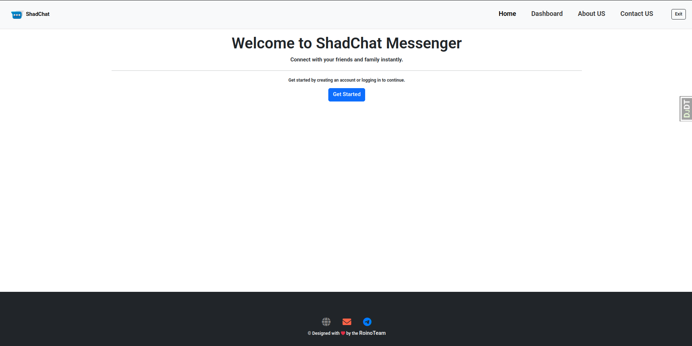
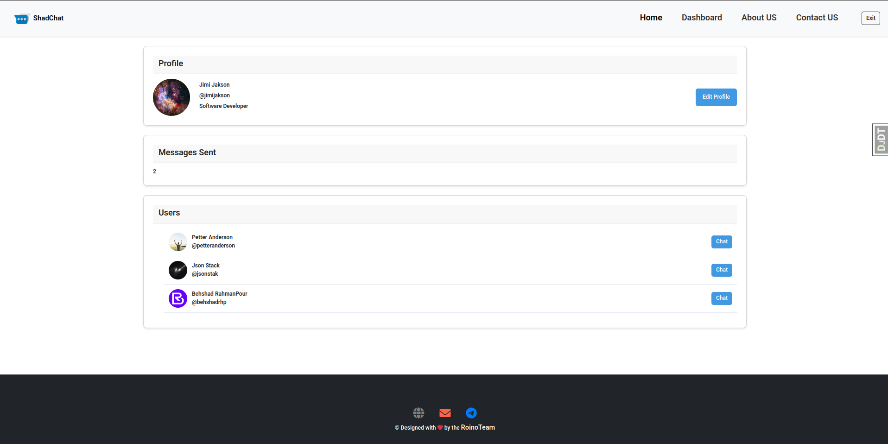
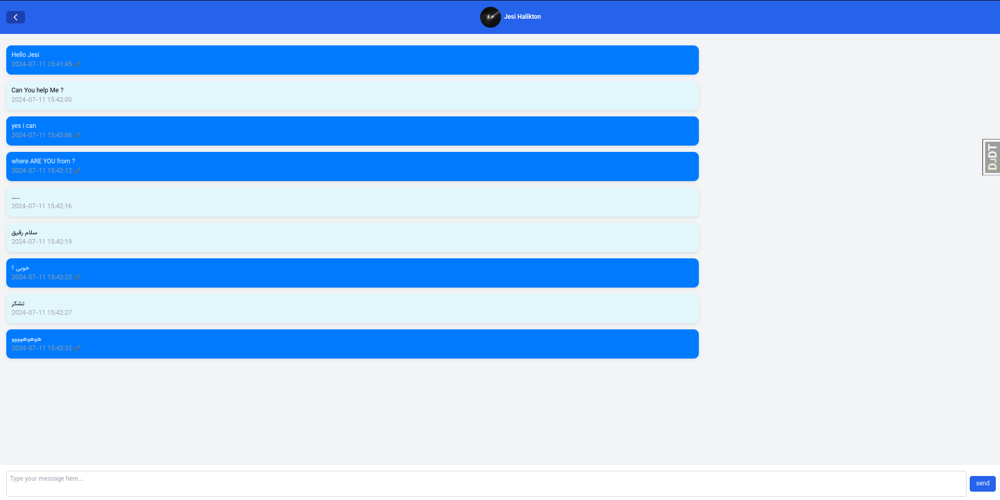
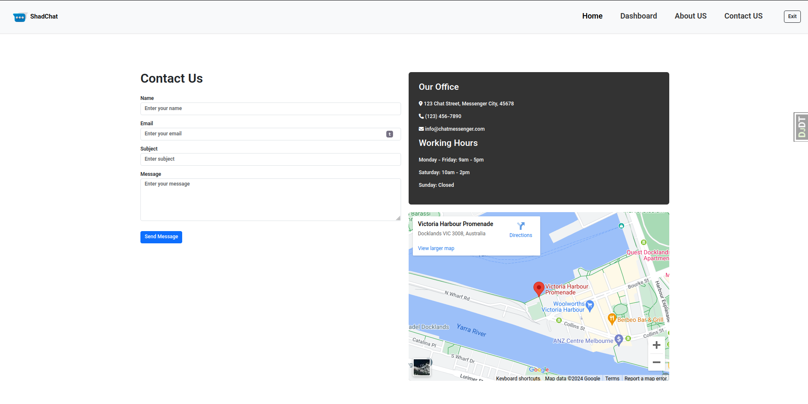
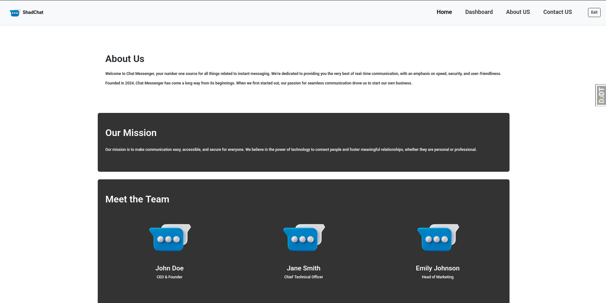

# ShadChat Messenger

ShadChat Messenger is a social media chat application built using Django and Django Channels. It allows users to chat with each other in real-time, view a list of all users, and see the number of messages they have sent.



## Features

- **Real-Time Messaging**: Chat with other users in real-time.
- **User Dashboard**: View a list of all users and see the number of messages you have sent.
- **Group Chats**: Create and join group chats.
- **Media Sharing**: Share photos, videos, and files with your contacts.
- **Notifications**: Receive notifications for new messages and other events.

## Installation

To get started with ShadChat Messenger, follow these steps:

1. **Clone the repository**:
    ```bash
    git clone https://github.com/behshadrhp/shadchat.git
    cd shadchat
    ```

2. **Create and activate a virtual environment**:
    ```bash
    python -m venv venv
    source venv/bin/activate  # On Windows use `venv\Scripts\activate`
    # or use the pipenv
    ```

3. **Install the dependencies**:
    ```bash
    pip install -r requirements.txt
    ```

4. **Run the migrations**:
    ```bash
    python manage.py migrate
    ```

5. **Start the development server**:
    ```bash
    python manage.py runserver
    ```

6. **Run the Django Channels server**:
    ```bash
    daphne -p 8001 shadchat.asgi:application
    ```

## Usage

1. **Create a new account** or **log in** with an existing account.
2. **Start chatting** with other users from the user dashboard.
3. **Create or join group chats** to stay connected with multiple friends at once.
4. **Share media** by uploading photos, videos, and files directly in the chat.

## Screenshots


*User Dashboard showing the list of all users and the number of messages sent.*


*Real-time chat interface.*


*Contact-US chat interface.*


*About-US chat interface.*

## Contributing

We welcome contributions! Please read our [Contributing Guide](CONTRIBUTING.md) to get started.

## License

This project is licensed under the MIT License. See the [LICENSE](LICENSE) file for more details.

## Contact

If you have any questions or need further assistance, feel free to contact us at [behshad.rahmanpour@gmail.com](mailto:behshad.rahmanpour@gmail.com).
